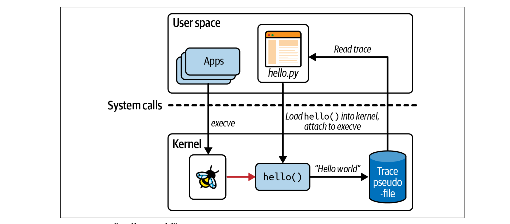

### eBPF from zero to hero

Hipolit Badowski  
Karriere.at  
27.02.24

---

# Introduction

- **Who Am I?**
  - DevOps Engineer 
  - Started as System Administrator
  - Enjoys unconventional solutions


---

# My eBPF Journey

- My personal journey into eBPF:
  - Cilium
  - Observability and Network Policies including the tools (e.g., Hubble) sparked my interest

---

# Prerequisites & Resources

### **Prerequisites:**
- Basic Linux knowledge.
- Understanding of programming fundamentals, e.g., C.

### **Tools and Resources:**
- **Online Documentation:** Explore detailed eBPF resources at [Prototype Kernel Documentation](https://prototype-kernel.readthedocs.io/en/latest/bpf/index.html).
- **Interactive Learning:** For a more engaging learning experience, check out resources recommended by Liz.

---

# How to Start Your eBPF Journey

- Liz's book is freely shared by Isovalent: [Learning eBPF](https://cilium.isovalent.com/hubfs/Learning-eBPF%20-%20Full%20book.pdf)
- Install necessary tools: `pacman -S bcc bcc-tools python-bcc`
- Explore `bcc` and `clang`
- [bcc-tools](https://github.com/iovisor/bcc)
- Dive into `XDP`
- Try out [Liz's Loadbalancer](https://github.com/lizrice/lb-from-scratch) - you can use cursor.sh for documentation parsing

---
# Getting Started with eBPF and Python

### **1. Python and BCC Example**

To begin exploring eBPF, let's start with a simple Python script using the BCC library. This script attaches an eBPF program to the `execve` system call, printing "Hello World!" whenever a new program is executed.

---

## Demo

```python
#!/usr/bin/python
from bcc import BPF                            # import BPF moduel from bcc
          
                                               # actual c code which will be loaded into Kernel
program = r"""
int hello(void *ctx) {                          
    bpf_trace_printk("Hello World!");
    return 0;
}
"""

b = BPF(text=program)
syscall = b.get_syscall_fnname("execve")        # defining which systemcall will be used
b.attach_kprobe(event=syscall, fn_name="hello") # attach our c code to syscall
b.trace_print()                                 # trace_print function prints output
```

---

## Demo



---

# Writing and Compiling an eBPF Program


Using `clang` and `llvm` to compile the eBPF program into an ELF object file.
```bash
clang -target bpf -l/usr/include/$(shell uname -m)-linux-gnu -g -O2 -o hello_counter.o -c hello_counter.c
```

---

The output `hello_counter.o` is an ELF object file containing the compiled eBPF program. This file can be loaded into the Linux kernel using eBPF tools like `bpftool` command-line tool or libraries like `BCC` or `libbpf`.


---

# Attaching eBPF XDP program to network interface

- bpftool prog load hello.bpf.o /sys/fs/bpf/hello
- bpftools prog list
- bpftool prog show id `x` --pretty
- bpftool net attach xdp id `x` dev `network adapter`
- bpftool prog tracelog

---

#### eBPF reading a eBPF map with Python

```c
    BPF_HASH(start, u32, u64);
    TRACEPOINT_PROBE(raw_syscalls, sys_exit)
    {
        u32 syscall_id = args->id;
        u32 key = 1;
        u64 *val;
        u32 uid = bpf_get_current_uid_gid();

        if (uid == 0)
        {
            val = start.lookup(&key); //find value associated with key 1
            if (val)
                bpf_trace_printk("Hello world, I have value %d!\\n", *val);
        }
        return 0;
    }
```  

---


```python
    thisStart = b["start"]
    thisStart[c_int(1)] = c_int(9) #insert key-value part 1->9


    while 1:
        try:
            (task, pid, cpu, flags, ts, msg) = b.trace_fields()
        except KeyboardInterrupt:
            print("Detaching")
            exit()
        print("%-18.9f %-16s %-6d %s" % (ts, task, pid, msg))
```

---

# Recap

- eBPF is no magic, and solid craft
- Now has the time come to support and implement it

---

# Q&A


- Dimi support
- There are no stupid questions

---

# Thank You

Let's Connect and Explore eBPF Together!

- Feel free to contact me:

[LinkedIn](https://at.linkedin.com/in/hipolitb)  
Email: [badowhp@gmail.com](mailto:badowhp@gmail.com)

---


